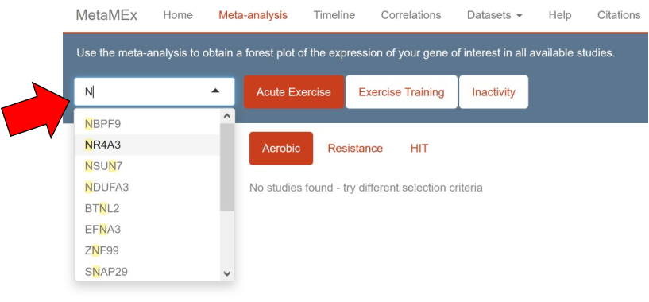
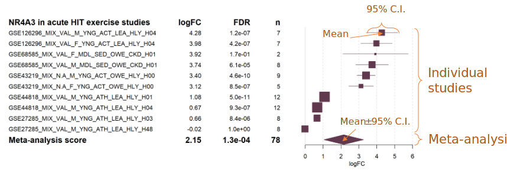
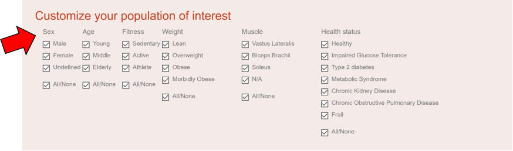
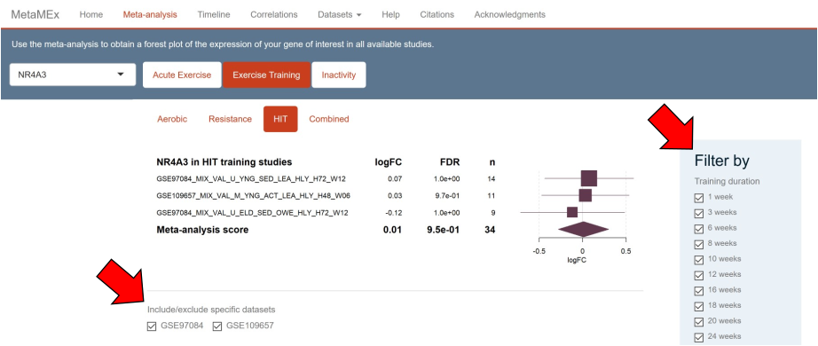
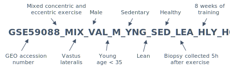

####  <a id="displayText" href="javascript:toggle(1);">I cannot find my favorite gene!</a>
  

Start typing the gene name and suggestions will appear in the scroll menu. MetaMEx works with official gene symbols, for instance the official gene name of PGC1α is PPARGC1A.

Genes are sometimes present in the forest plots but not in the timeline plots. This is because the timeline is calculated by including all datasets and applying specific inclusion/exclusion to balance the linear model. This results in genes being excluded if they are not detected in enough datasets at each time point.

  
  

  
####  <a id="displayText" href="javascript:toggle(2);">My favorite gene is not detected in many studies!</a>
  

In order to give a transparent overview of the currently available data, all studies are presented, even if genes are not detected. Older studies, or custom arrays often have a limited number of probes and therefore fewer detected genes. On the other hand, the more recent RNA sequencing datasets often have more depth and detect non-coding RNAs which are not present in gene arrays.

  
  
  
  
####  <a id="displayText" href="javascript:toggle(3);">How do I read a forest plot?</a>
  

A forest plot is a graphical representation of results from several scientific studies and is typically used to plot meta-analyses. The left-hand columns list the names of the studies, followed by the fold-change (log2), false discovery rate (FDR) and sample size (n) for each individual study. The right-hand column is a plot of the fold-change (log2) represented by a square and the 95% confidence intervals represented by horizontal lines. The area of each square is proportional to the study's weight (sample size) in the meta-analysis. The overall meta-analysed score is represented by a diamond on the bottom line, the lateral points of which indicate confidence intervals. 

  
 
  
  
####  <a id="displayText" href="javascript:toggle(4);">How do I select my population of interest?</a>
  

MetaMEx compiles more than 90 studies which include volunteers of different age, sex, weight, fitness, weight and health. Studies can be included or excluded from the analysis by scrolling at the bottom of the page and checking the boxes. For instance, select males or females by checking the corresponding tick boxes.

*	**Sex.** Choose whether you want males (M) or females (F). Some studies have pooled males and females or did not provide sex information and are labelled as undefined (U).
*	**Age.** Studies in MetaMEx are split into three age groups: young (<35), middle age (35-60) and elderly (>60).
*	**Fitness**. Activity levels were determined based on the description of the cohorts available in the publications. Sedentary is defined as no formal exercise training. Individuals performing exercise for more than 150 min per week and/or having an average VO2max are considered active. Athletes are individuals engaged in formal and regular exercise training and exhibit good to excellent VO2max.
*	**Weight.** Body composition is based on body mass index provided in the publications and the actual definition of lean (BMI<25), overweight (25≤BMI<30), obese (30≤BMI<40) and morbidly obese (BMI≥40).
*	**Muscle.** Most studies do cycling exercise and therefore collect vastus lateralis (quadriceps) biopsies. However, a handful of studies used soleus or biceps biopsies. Sometimes the muscle biopsy is unknow and is therefore annotated as N.A. 
*	**Health.** MetaMEx includes studies from healthy individuals with no history of disease as well as people diagnosed with metabolic diseases or other chronic conditions such as chronic kidney disease or frailty.

  
  
  
  
####  <a id="displayText" href="javascript:toggle(5);">What filters can I apply?</a>
  

After selecting  either acute exercise, exercise training or inactivity, a specific menu will appear on the right of the page. This menu includes parameters such as exercise duration or time of biopsy collection after exercise cessation. Another list will appear under the forest plot to select or unselect specific datasets.

* **Acute exercise studies.** For acute exercise protocols, it is possible to customize the type of exercise (concentric, eccentric or mixed) and the time of the biopsy collection after exercise cessation.
* **Exercise training studies.** For exercise training protocols, it is possibly to customize the duration of the training (from 1 week to lifelong) and the time of the biopsy collection after exercise cessation. It is also possible to include/exclude specific studies based on their GEO accession number.
* **Inactivity studies.** MetaMEx includes two inactivity protocols: bed rest or limb immobilization. It is also possible to customize the duration of the inactivity and include/exclude specific studies based on their GEO accession number.

  
  

####  <a id="displayText" href="javascript:toggle(6);">Why do studies have such a complicated name?</a>
  

All studies were annotated with as much information as possible about age, weight, health, biopsy, muscle, etc. The title of the studies reflects the clinical data and protocol used for a specific study. 

A detailed description of the labels is availabe in Datasets/Annotation.

  
  
  
  
####  <a id="displayText" href="javascript:toggle(7);">What analysis and statistical methods were used?</a>
  

The meta-analysis was created by collecting publicly available studies on mRNA expression levels in human skeletal muscle after exercise or inactivity. Statistics were first performed individually for each array. 

* Robust multiarray averaging was used for affymetrix arrays (oligo package)
* Quantile normalization was used for other microarrays (limma package)
* RNA sequencing datasets were processed using the edgeR package following the standard pipeline (https://bioconductor.org/packages/devel/workflows/vignettes/RnaSeqGeneEdgeRQL/inst/doc/edgeRQL.html). 
* Moderated t-statistics were calculated for each  study with empirical Bayes statistics for differential expression (limma package).

The meta-analysis summary was calculated using restricted maximum likelihood (metafor package). The analysis was weighted using sample size (n) to adjust for studies with small number of volunteers. 

The timeline was calculated by collecting all data available in the database and annotate them by either time of the biopsy or inactivity duration. Moderated t-statistics were calculated with empirical Bayes statistics after blocking for other confounding parameters (sex, age, exercise type...).

Since MetaMEx v3.2205, p values are adjusted for multiple-comparison with the more conservative Bonferroni method. This compensates for the increasing number of studies added to the database leading to more statistical power. The use of Bonferroni correction further reduces the risk of false positives.

  

####  <a id="displayText" href="javascript:toggle(8);">Why are statistics on the website different from what is reported in the original publications?</a>
  

Whenever possible, we downloaded the raw data and re-processed studies from raw data files (CEL, fastq...). That means that the processing and normalization methods that we used might differ from the ones used by the original authors. In addition, samples were often insufficiently annotated to allow us to run paired statistics comparing pre/post interventions. We therefore had to used unpaired statistics and lost power in the process. Finally, many studies pooled individuals of different age and BMI to have higher sample size. To allow proper comparison in the meta-analysis, we split these studies into sub groups and analyzed them separately, therefore reducing the sample size and statistical power.

  

  

####  <a id="displayText" href="javascript:toggle(9);">What is the version history of the database?</a>
  

  
* MetaMEx 3.2207 - July 2022. Addition of mouse datasets. Addition of timeline plots for acute and inactivity studies. All RNA sequencing datasets realigned to the most recent annotations (Human GRCh38.102 and mouse GRCm39.104). Addition of the most recently published human and mouse datasets.
* MetaMEx 2.2101 - Jan 2021. Addition of recently published studies.
* MetaMEx 2.2008 - Aug 2020. Major update of the database and style of the app. Addition of the most recent published datasets. Adjustment of colors and style for accessibility. 
* MetaMEx 1.1912 - Dec 19, 2019. Added published HIIT studies.
* MetaMEx 1.1902 - Feb 12, 2019. Updated clinical characteristics of studies with obesity status.
* MetaMEx 1.1809 - Sep 20, 2018. Added feature for correlations, improved speed and added progress bars.
* MetaMEx 1.1805 - Initial release on May 22, 2018.

  

  

####  <a id="displayText" href="javascript:toggle(10);">Where any studies excluded from the database?</a>
  

  
Only one study, GSE165630, was excluded from the database. This study compared trained and untrained individuals. However, the studies clustered with acute exercise studies, and exhibited a gene signature typical of an acute response to exercise.

  

